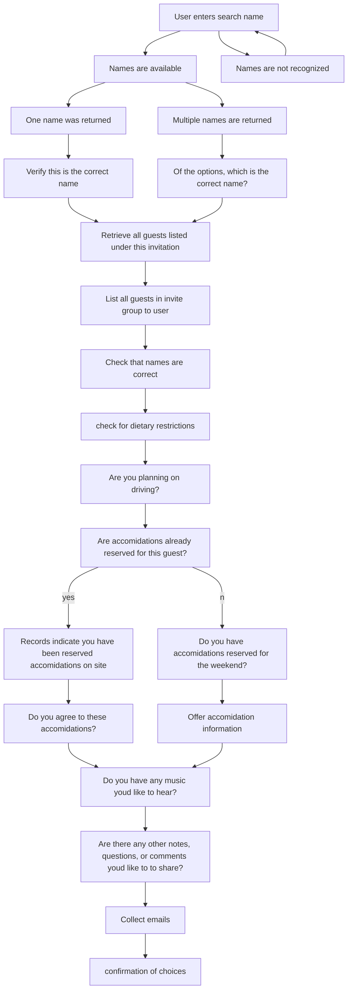

```mermaid

graph TD
	ID1[User enters search name] --> ID2[Names are available]
	ID1 --> ID3[Names are not recognized]
	ID3 --> ID1
	ID2 --> ID4[One name was returned]
	ID2 --> ID5[Multiple names are returned]
	ID4 --> ID6[Verify this is the correct name]
	ID5 --> ID7[Of the options, which is the correct name?]
	ID6 & ID7 --> ID8[Retrieve all guests listed under this invitation]
	ID8 --> ID9[List all guests in invite group to user]
	ID9 --> ID10[Check that names are correct]
	ID10 --> ID11[check for dietary restrictions]
	ID11 --> ID12[Are you planning on driving?]
	ID12 --> ID13[Are accomidations already reserved for this guest?]
	ID13 --yes--> ID14[Records indicate you have been reserved accomidations on site]
	ID14 --> ID15[Do you agree to these accomidations?]
	ID13 --no--> ID16[Do you have accomidations reserved for the weekend?]
	ID16 --> ID17[Offer accomidation information]
	ID15 & ID17 --> ID18[Do you have any music youd like to hear?]
	ID18 --> ID19[Are there any other notes, questions, or comments youd like to to share?]
	ID19 --> ID20[Collect emails]
	ID20 --> ID21[confirmation of choices]
		

```